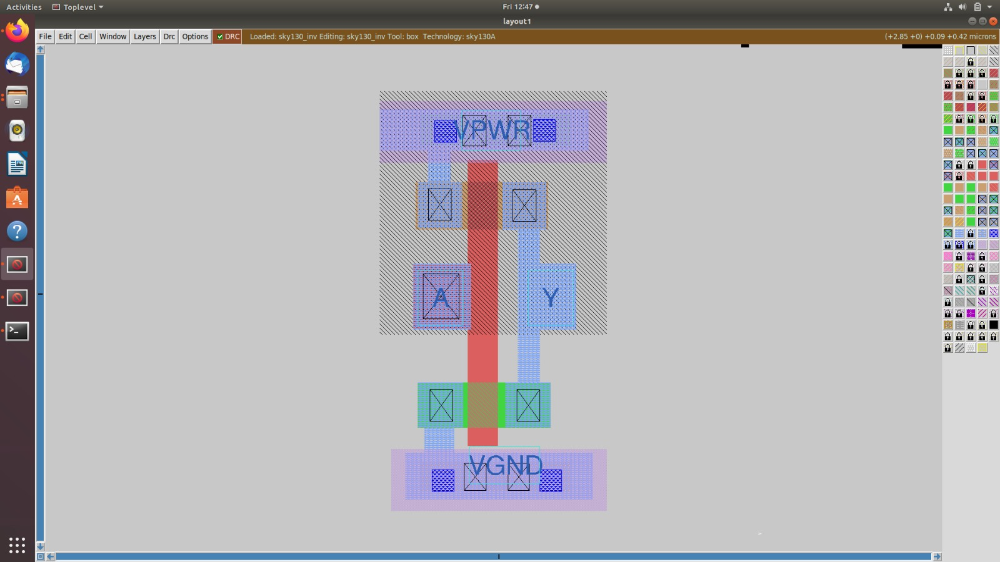

# 🧠 Physical Design Workshop — Week 6

🧩 Libraries → 🧱 Layout → ⚡ SPICE Characterization → ⏱️ Timing → 🛣️ Routing → ✅ Sign-off Ready

---

## 📅 Week 6 — Physical Design & Standard Cell Development

This week focused on in-depth **physical design concepts**, **standard cell creation**, and **end-to-end OpenLane flow execution**.  
Hands-on work was done using **Magic**, **ngspice**, **OpenLane**, **Sky130 PDK**, and **OpenSTA**.

---

### 🧪 Day 1 — Inception of Open-Source EDA, OpenLane & Sky130 PDK

#### 📘 Objective
Understand the role of **open-source EDA tools**, OpenLane architecture, and Sky130 PDK structure.

#### ⚙️ Key Topics
- Introduction to Open-source EDA
- OpenLane RTL2GDS flow pipeline
- Sky130 PDK architecture & file ecosystem

#### 🧰 Summary
- Explored PDK directory tree
- Understood `.lef`, `.lib`, `.gds`, `.spice` importance
- Mapped steps of the OpenLane flow

---

### 🧪 Day 2 — Good vs Bad Floorplan & Library Files

#### 📘 Objective
Learn the characteristics of good floorplanning and library file usage.

#### ⚙️ Key Topics
- Floorplan quality metrics
- Power distribution network
- Standard cell libraries: LEF, GDS, LIB files

#### 🧰 Summary
- Studied pin placement, congestion, blockages
- Understood effects of poor PDN
- Mapped library files to OpenLane flow

---

### 🧪 Day 3 — Design Library Cell Using Magic & ngspice

#### 📘 Objective
Create and simulate a CMOS inverter standard cell.

#### ⚙️ Key Topics
- Magic layout editor
- SPICE simulations for cell characterization
- CMOS fabrication steps (active, poly, contacts, metal)

#### 🧰 Steps Performed
- Drew CMOS inverter layout
- Extracted SPICE netlist from Magic
- Performed DC and transient simulation in ngspice

#### 🖼️ Images

- Layout in Magic  
- Extracted SPICE file  
- Inverter switching waveform  

---

### 🧪 Day 4 — Pre-Layout STA & Clock Tree Importance

#### 📘 Objective
Perform pre-layout timing analysis and learn clock tree fundamentals.

#### ⚙️ Key Topics
- Timing slack, setup/hold, critical paths
- Clock tree distribution
- Skew & insertion delay significance

#### 🧰 Summary
- Ran OpenSTA timing commands
- Studied timing violations causes
- Understood need for balanced clock tree

---

### 🧪 Day 5 — Final RTL2GDS: TritonRoute & STA

#### 📘 Objective
Complete routing and verify timing for tape-out readiness.

#### ⚙️ Key Topics
- TritonRoute global & detailed routing
- SPEF extraction basics
- Final timing validation using OpenSTA

#### 🧰 Summary
- Completed full RTL → GDS flow
- Checked for DRC violations
- Verified timing closure

---

### ✅ Key Learnings

- Understood open-source VLSI design ecosystem
- Built and characterized a **custom standard cell**
- Mastered library files: `.lef`, `.lib`, `.gds`, `.spice`
- Performed **STA** and **custom layout simulation**
- Completed **full RTL2GDS flow**

---

## 🙏 Acknowledgment

### 🏆 Program Leadership & Support

Thanks to **Kunal Ghosh** and the **VSD Team** for guidance throughout Week 6.

---

## 📈 Weekly Progress Tracker

### 🚀 Onward…

Next: **Clock Tree Synthesis → Routing → Tape-out Prep** 🚀

---

**🔗 Program Links**

  
  

**👨‍💻 Participant:** [VEERARAGAVAN7](https://github.com/VEERARAGAVAN7)

