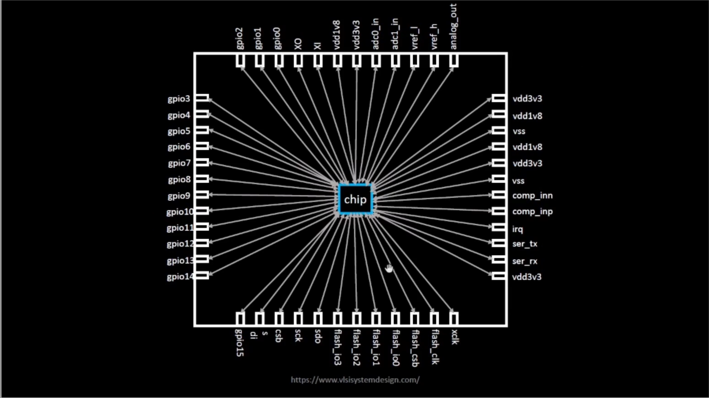

# 🧠 Week 6 – Day 1  
## Inception of Open-Source EDA: OpenLANE and Sky130 PDK  

---

### 📚 Contents  
- [How to Talk to a Computer](#how-to-talk-to-a-computer)  
  - [Introduction to QFN-48 Package, Chip, Pads, Core, Die, and IPs](#introduction-to-qfn-48-package-chip-pads-core-die-and-ips)  
  - [Introduction to RISC-V](#introduction-to-risc-v)  
  - [From Software to Hardware](#from-software-to-hardware)  
- [SoC Design and OpenLANE](#soc-design-and-openlane)  
  - [Introduction to All Components of Open-Source Digital ASIC Design](#introduction-to-all-components-of-open-source-digital-asic-design)  
  - [Simplified RTL2GDS Flow](#simplified-rtl2gds-flow)  
  - [Introduction to OpenLANE and Strive Chipsets](#introduction-to-openlane-and-strive-chipsets)  
  - [Introduction to OpenLANE Detailed ASIC Design Flow](#introduction-to-openlane-detailed-asic-design-flow)  
- [Get Familiar with Open-Source EDA Tools](#get-familiar-with-open-source-eda-tools)  
  - [OpenLANE Directory Structure in Detail](#openlane-directory-structure-in-detail)  
  - [Design Preparation Step](#design-preparation-step)  
  - [Review Files After Design Prep and Run Synthesis](#review-files-after-design-prep-and-run-synthesis)  
  - [OpenLANE Project Git Link Description](#openlane-project-git-link-description)  
  - [Steps to Characterize Synthesis Results](#steps-to-characterize-synthesis-results)  

---

## 🖥️ How to Talk to a Computer  

### 🔹 Introduction to QFN-48 Package, Chip, Pads, Core, Die, and IPs  
In any embedded board, what we usually call a “chip” is actually the **package** — a protective layer over the actual silicon die. The **chip** lies at the center of the package, connected to it through **wire bonding**.  

  

Inside the chip:  
- **Pads** handle all external connections.  
- The **Core** contains the logic circuits.  
- Both pads and core together form the **Die**, the basic manufacturing unit of a chip.  

  

**Foundries** manufacture chips. Their specialized design blocks are called **Foundry IPs**, while reusable logic blocks are known as **Macros**.  

  

---

### 🔹 Introduction to RISC-V  

A **C program** must follow a flow before reaching hardware execution.  
It first compiles into **RISC-V assembly instructions (ISA)**, which are then converted into **binary machine language (0s and 1s)** understood by hardware.  

The **RISC-V ISA (Reduced Instruction Set Computing – V)** defines how the software communicates with the hardware.  

  

Finally, the **RTL** (Hardware Description Language) implements these instructions, and through the **PnR (Place and Route)** process, we reach the **final GDSII layout** ready for fabrication.  

---

### 🔹 From Software to Hardware  

When an application (like a stopwatch app) runs on hardware, several layers are involved:  

1. **Application Software** → C/C++/Java code  
2. **System Software** → Converts to binary  
   - Includes **OS**, **Compiler**, and **Assembler**  
3. **Hardware** → Executes the binary code  

  

Example flow for a stopwatch app on a RISC-V core:  

- Compiler output → RISC-V instructions  
- Assembler output → Binary machine code  
- RTL implements these instructions  
- RTL synthesized → Gate-level netlist  
- Fabricated into the chip  

  

This course covers three main parts:  
1. **RISC-V ISA**  
2. **RTL and Synthesis of RISC-V-based CPU Core (PicoRV32)**  
3. **Physical Design Implementation of PicoRV32**  

  

---

## ⚙️ SoC Design and OpenLANE  

### 🔹 Introduction to All Components of Open-Source Digital ASIC Design  

For open-source ASIC design, three major enablers are required:  
1. **RTL Designs**  
2. **EDA Tools**  
3. **PDK Data (Process Design Kit)**  

  

Initially, chip design and fabrication were tightly coupled. In 1979, **Lynn Conway** and **Carver Mead** revolutionized this by separating **design** and **fabrication**, introducing structured design rules and the concept of **fabless companies**.  

  

The interface between design and fabrication became the **Process Design Kit (PDK)** — containing device models, libraries, and design rules.  

Google’s collaboration with **SkyWater** led to the release of the first **open-source PDK (Sky130)** in June 2020.  

---

### 🔹 Simplified RTL2GDS Flow  

The **ASIC Design Flow** takes a design from **RTL → GDSII** (fabrication layout format).  

  

**Synthesis** converts RTL code into gate-level circuits using **Standard Cell Libraries (SCLs)**, producing a **netlist**.  

  

Each standard cell has multiple views:  
- **Liberty View (.lib)** – Timing & power data  
- **Behavioral Model (HDL)** – Functional model  
- **SPICE/CDL View** – Transistor-level netlist  
- **Layout View (GDSII, LEF)** – Physical layout  


---

### 🔹 Introduction to OpenLANE and Strive Chipsets  

**OpenLANE** is an open-source ASIC design automation flow developed for **Sky130 PDK**. It integrates multiple EDA tools to perform synthesis, floorplanning, placement, CTS, routing, and sign-off.  

  

The **Strive** family of open-source chipsets are built using this exact flow, demonstrating the real-world success of open-source silicon.  

---

### 🔹 Introduction to OpenLANE Detailed ASIC Design Flow  

1. **Chip Floorplanning** – Define chip dimensions and pad locations  
     
2. **Macro Floorplanning** – Place large IP blocks  
     
3. **Power Planning** – Distribute power efficiently to avoid IR drop and electromigration  
     
4. **Placement** – Global and detailed cell placements  
     
5. **Clock Tree Synthesis (CTS)** – Ensure clock signal reaches all components with minimal skew  
     
6. **Routing** – Connect all cells; SkyWater PDK uses 6 routing layers  
     

After routing, sign-off checks ensure correctness:  
- **DRC** (Design Rule Check)  
- **LVS** (Layout vs Schematic)  
- **STA** (Static Timing Analysis)  

  

---

## 🧩 Get Familiar with Open-Source EDA Tools  

### 🔹 OpenLANE Directory Structure in Detail  
Explore folders like `designs/`, `pdks/`, and `flow/` to understand configuration and result storage.  

  

### 🔹 Design Preparation Step  
The design prep step sets up all required files for synthesis and physical design.  
  

### 🔹 Review Files After Design Prep and Run Synthesis  
After preparation, you can verify generated netlists, logs, and synthesis reports.  

#### Synthesis


Day1 tasks:- 
1. Run 'picorv32a' design synthesis using OpenLANE flow and generate necessary outputs.
2. Calculate the flop ratio.

```math
Flop\ Ratio = \frac{Number\ of\ D\ Flip\ Flops}{Total\ Number\ of\ Cells}
```
```math
Percentage\ of\ DFF's = Flop\ Ratio * 100
```

* All day 1 logs, reports and results can be found in following run folder:
'''

'''

#### 1. Run 'picorv32a' design synthesis using OpenLANE flow and generate necessary outputs.

Commands to invoke the OpenLANE flow and perform synthesis

```bash
# Change directory to openlane flow directory
cd Desktop/work/tools/openlane_working_dir/openlane

# alias docker='docker run -it -v $(pwd):/openLANE_flow -v $PDK_ROOT:$PDK_ROOT -e PDK_ROOT=$PDK_ROOT -u $(id -u $USER):$(id -g $USER) efabless/openlane:v0.21'
# Since we have aliased the long command to 'docker' we can invoke the OpenLANE flow docker sub-system by just running this command
docker
```
```tcl
# Now that we have entered the OpenLANE flow contained docker sub-system we can invoke the OpenLANE flow in the Interactive mode using the following command
./flow.tcl -interactive

# Now that OpenLANE flow is open we have to input the required packages for proper functionality of the OpenLANE flow
package require openlane 0.9

# Now the OpenLANE flow is ready to run any design and initially we have to prep the design creating some necessary files and directories for running a specific design which in our case is 'picorv32a'
prep -design picorv32a

# Now that the design is prepped and ready, we can run synthesis using following command
run_synthesis

# Exit from OpenLANE flow
exit

# Exit from OpenLANE flow docker sub-system
exit
```

Screenshots of running each commands

  
  


#### 2. Calculate the flop ratio.

Screenshots of synthesis statistics report file with required values highlighted

  
  

Calculation of Flop Ratio and DFF % from synthesis statistics report file

```math
Flop\ Ratio = \frac{1613}{14876} = 0.108429685
```
```math
Percentage\ of\ DFF's = 0.108429685 * 100 = 10.84296854\ \%
```


### 🔹 OpenLANE Project Git Link Description  
The OpenLANE GitHub repository provides detailed documentation and flow control for all open-source ASIC projects.  
```
https://github.com/efabless/openlane2
```
### 🔹 Steps to Characterize Synthesis Results  
Characterization involves analyzing cell timing, area, and power data post-synthesis to verify correctness.  

  
---


