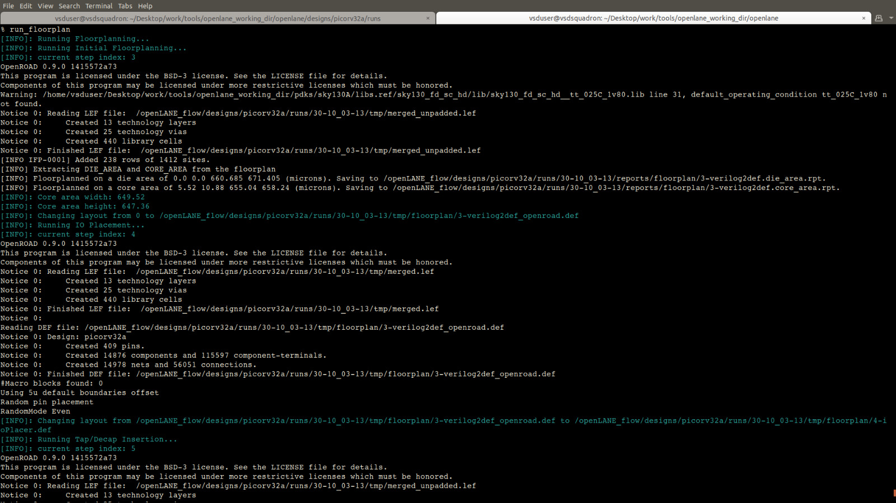
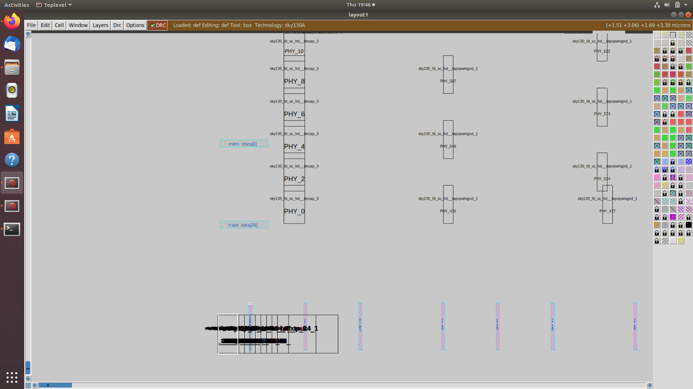

# 🚀 Sky130 – Day 2  
## Good Floorplan vs Bad Floorplan and Introduction to Library Cells  

---

### 📚 Contents  
- [Chip Floorplanning Considerations](#chip-floorplanning-considerations)  
  - [Utilization Factor and Aspect Ratio](#utilization-factor-and-aspect-ratio)  
  - [Concept of Pre-Placed Cells](#concept-of-pre-placed-cells)  
  - [Decoupling Capacitors](#decoupling-capacitors)  
  - [Power Planning](#power-planning)  
  - [Pin Placement and Logical Cell Placement Blockage](#pin-placement-and-logical-cell-placement-blockage)  
  - [Steps to Run Floorplan using OpenLANE](#steps-to-run-floorplan-using-openlane)  
  - [Review Floorplan Files and View Floorplan](#review-floorplan-files-and-view-floorplan)  
  - [Review Floorplan Layout in Magic](#review-floorplan-layout-in-magic)  
- [Library Binding and Placement](#library-binding-and-placement)  
  - [Netlist Binding and Initial Place Design](#netlist-binding-and-initial-place-design)  
  - [Optimize Placement using Estimated Wire-Length and Capacitance](#optimize-placement-using-estimated-wire-length-and-capacitance)  
  - [Final Placement Optimization](#final-placement-optimization)  
  - [Need for Libraries and Characterization](#need-for-libraries-and-characterization)  
  - [Congestion-Aware Placement using RePlAce](#congestion-aware-placement-using-replace)  
- [Cell Design and Characterization Flows](#cell-design-and-characterization-flows)  
  - [Inputs for Cell Design Flow](#inputs-for-cell-design-flow)  
  - [Circuit Design Step](#circuit-design-step)  
  - [Layout Design Step](#layout-design-step)  
  - [Typical Characterization Flow](#typical-characterization-flow)  
- [General Timing Characterization Parameters](#general-timing-characterization-parameters)  
  - [Timing Threshold Definitions](#timing-threshold-definitions)  
  - [Propagation Delay and Transition Time](#propagation-delay-and-transition-time)  

---

## 🧩 Chip Floorplanning Considerations  

### 🔹 Utilization Factor and Aspect Ratio  
- **Utilization Factor (UF)** = (Area occupied by cells / Total core area).  
  - High UF ⇒ Compact design but can cause routing congestion.  
  - Low UF ⇒ More routing space but larger chip size.  
- **Aspect Ratio (AR)** = Height / Width of the core.  
  - AR = 1 gives a square core, preferred for balanced routing.  

  
  

---

### 🔹 Concept of Pre-Placed Cells  
Pre-placed cells are large functional blocks such as memories, PLLs, or analog IPs placed early in the floorplan to define core structure and connectivity.  
They are fixed during placement to ensure stable timing paths and predictable layout quality.  

  
  
---

### 🔹 Decoupling Capacitors  
Decoupling capacitors (**Decaps**) are placed near logic clusters to minimize voltage fluctuations due to instantaneous current demands.  
They help maintain stable **VDD** levels during high-speed switching and reduce IR drop noise.  

  
  
---

### 🔹 Power Planning  
Power Planning involves creating **VDD/VSS power grids** across the chip to deliver stable supply voltage.  
Upper metal layers are used for **power straps** because of their lower resistance and higher current-carrying capacity.  

  

#### problem in the above VDD supply: 
Due to single voltage source, it may get weaken due to the resistance,inductance in the circuit. So this leads to inadequate availablity of supply in the input of the cells  

  

#### SOlution for the above problem:
Providing Mutliple Vdd and Vss tap points reduces the chance of getting above problem

  
The above Screenshots explain how vdd and vss line will be facbricated in the chip. The above problem is the reason why all modern processors have multiple Vdd and Vss ports.
---

### 🔹 Pin Placement and Logical Cell Placement Blockage  
- **Pin Placement:** Properly positioned I/O pins minimize routing congestion and timing delay.  
- **Placement Blockages:** Used to reserve areas where no standard cells should be placed — helpful near macros or high-activity regions.  

  

---

### 🔹 Steps to Run Floorplan using OpenLANE  
1. Navigate to the OpenLANE design directory.  
2. Run the floorplan command:  

   ```bash
    # Change directory to openlane flow directory
    cd Desktop/work/tools/openlane_working_dir/openlane

    # alias docker='docker run -it -v $(pwd):/openLANE_flow -v $PDK_ROOT:$PDK_ROOT -e PDK_ROOT=$PDK_ROOT -u $(id -u $USER):$(id -g $USER) efabless/openlane:v0.21'
    # Since we have aliased the long command to 'docker' we can invoke the OpenLANE flow docker sub-system by just running this command
    docker
    # Now that we have entered the OpenLANE flow contained docker sub-system we can invoke the OpenLANE flow in the Interactive mode using the following command
    ./flow.tcl -interactive

    # Now that OpenLANE flow is open we have to input the required packages for proper functionality of the OpenLANE flow
    package require openlane 0.9

    # Now the OpenLANE flow is ready to run any design and initially we have to prep the design creating some necessary files and directories for running a specific design which in our case is 'picorv32a'
    prep -design picorv32a

    # Now that the design is prepped and ready, we can run synthesis using following command
    run_synthesis

    # Now we can run floorplan
    run_floorplan
    ```
    
3. Check log files in runs/<design_name>/logs/floorplan/.
4. Generated DEF and LEF files define placement boundaries and I/O regions.

  
  
  


#### Area of the die can be calucluated :
  

### 🔹 Review Floorplan Layout in Magic

Open the generated layout in Magic VLSI to visualize standard cell regions, pin positions, and power grid routing.
    ```bash
    # Change directory to path containing generated floorplan def
    cd Desktop/work/tools/openlane_working_dir/openlane/designs/picorv32a/runs/17-03_12-06/results/floorplan/

    # Command to load the floorplan def in magic tool
    magic -T /home/vsduser/Desktop/work/tools/openlane_working_dir/pdks/sky130A/libs.tech/magic/sky130A.tech lef read ../../tmp/merged.lef def read picorv32a.floorplan.def &
    ```
#### The Below Screenshots Ensures the Floorplan impact in the ciruit layout:

Picorv32a :
  

Equidistance placement of pins
  

Metal data and it's pin type
  

  

Equidistance placement of tapcells 
  

Unplaced standard cells
  


-----

## ⚙️ Library Binding and Placement

### 🔹 Netlist Binding and Initial Place Design

After synthesis, the netlist (gate-level design) is mapped to available standard cells from the library.
OpenLANE performs initial placement using this binding information to ensure cell connectivity consistency.

 

### 🔹 Optimize Placement using Estimated Wire-Length and Capacitance

Placement optimization minimizes wire-length and capacitive load between connected cells.
Estimated interconnect lengths help the tool improve timing and reduce power.
Repeater(Buffers) are used to ensure the signal intergrity. Repeaters are placed where the cell is far away from the required pin.

 

### 🔹 Final Placement Optimization

Final placement fine-tunes cell positions to eliminate overlaps, ensure proper alignment, and meet timing closure constraints.

 

### 🔹 Need for Libraries and Characterization

Libraries contain timing, power, and physical data for each standard cell.
Characterization ensures that every cell behaves as expected across process, voltage, and temperature corners (PVT).


Different flavours of same cell


### 🔹 Congestion-Aware Placement using RePlAce

RePlAce is OpenLANE’s global placement engine. It performs congestion-aware placement by balancing density and connectivity, preventing routing bottlenecks and improving timing.

Run 'picorv32a' design congestion aware placement using OpenLANE flow and generate necessary outputs.
Command to run placement:
    ```bash
        # Congestion aware placement by default
        run_placement
    ```
    


Load generated placement def in magic tool and explore the placement.
Commands to load placement def in magic in another terminal.

    ```bash
        # Change directory to path containing generated placement def
        cd Desktop/work/tools/openlane_working_dir/openlane/designs/picorv32a/runs/17-03_12-06/results/placement/

        # Command to load the placement def in magic tool
        magic -T /home/vsduser/Desktop/work/tools/openlane_working_dir/pdks/sky130A/libs.tech/magic/sky130A.tech lef read ../../tmp/merged.lef def read picorv32a.placement.def &
    ```


Close view of Standard cell after placement


----

## 🧠 Cell Design and Characterization Flows

### 🔹 Inputs for Cell Design Flow

##### Inputs include:
- Specification sheet
- Process Design Kit (PDK)
- SPICE models
- Design constraints


### 🔹 Circuit Design Step

At this stage, transistor-level schematics are designed using tools like Xschem or Ngspice to verify logical and electrical behavior.


### 🔹 Layout Design Step

The schematic is translated into a physical layout using Magic VLSI, following design rules and layer definitions from the PDK.
The layout is then verified using DRC and LVS checks.

### Schematics --> Networkgraph --> Euler's path --> Stick Diagram --> Layout


Layout from Stick diagram


### 🔹 Typical Characterization Flow

Each cell undergoes:
- SPICE simulation for timing extraction.
- Delay measurement across multiple load/slew conditions.
- Generation of .lib timing models for synthesis and STA tools.


----

## ⏱️ General Timing Characterization Parameters

### 🔹 Timing Threshold Definitions

Timing analysis uses threshold voltage points to define signal transitions.
- Input threshold ≈ 50% of VDD
- Output threshold ≈ 50% of VDD
These points determine where propagation delay is measured.


### 🔹 Propagation Delay and Transition Time
Propagation Delay (tp): Time for the output to respond to an input change (measured from 50% Vin → 50% Vout).
Transition Time (Tr/Tf): Time taken for a signal to rise (10% → 90%) or fall (90% → 10%).
These parameters are critical in library characterization for accurate timing closure.


